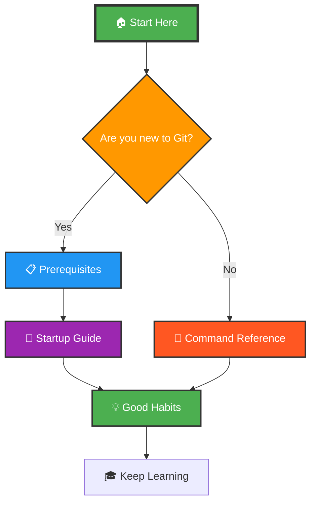

<div align="center">


# 🚀 Git & GitHub Documentation Guide 🚀

### ✨ *A comprehensive, structured reference for mastering version control* ✨


[](https://github.com/arunvk/git-github-docs)
[](https://github.com/arunvk/git-github-docs)
[](LICENSE)

```ascii
   _____ _ _            ___     _____ _ _   _    _       _     
  / ____(_) |          ( _ )   / ____(_) | | |  | |     | |    
 | |  __ _| |_   __   / _ \/\ | |  __ _| |_| |__| |_   _| |__  
 | | |_ | | __| |__|  | (_>  < | | |_ | | __|  __  | | | | '_ \ 
 | |__| | | |_         \___/\/ | |__| | | |_| |  | | |_| | |_) |
  \_____|_|\__|                 \_____|_|\__|_|  |_|\__,_|_.__/ 
                                                                 
              📚 Your Ultimate Version Control Resource 📚
```

**⭐ Star this repo to bookmark it for later! ⭐**

</div>

---

## 🌟 Welcome to Your Git Journey!

<table>
<tr>
<td width="60%">

This repository is a **complete learning resource** for Git and GitHub, built from the ground up to help developers at all levels understand and master version control. Whether you're writing your first commit or managing complex workflows, you'll find clear explanations, practical examples, and professional best practices organized in a logical, easy-to-follow structure.

The documentation covers everything from initial setup requirements to advanced command usage, with special attention to the habits and workflows that separate professional developers from beginners. Each section builds on the previous one, creating a natural learning path that takes you from installation to confident daily use.

**This isn't just a command reference—it's a complete guide to thinking about version control the right way.**

</td>
<td width="40%">


### 🎯 Quick Stats


</td>
</tr>
</table>

---

<div align="center">

## 📑 Table of Contents

</div>

<table align="center">
<tr>
<td align="center" width="20%">

### 📋
**Prerequisites**

</td>
<td align="center" width="20%">

### 🚀
**Startup Guide**

</td>
<td align="center" width="20%">

### 📘
**Commands**

</td>
<td align="center" width="20%">

### 📝
**Source Materials**

</td>
<td align="center" width="20%">

### 💡
**Good Habits**

</td>
</tr>
<tr>
<td align="center">

[View Section →](#-01_prerequisites)

</td>
<td align="center">

[View Section →](#-02_startup_guide)

</td>
<td align="center">

[View Section →](#-03_command_reference)

</td>
<td align="center">

[View Section →](#-04_source_materials)

</td>
<td align="center">

[View Section →](#-05_good_habits)

</td>
</tr>
</table>

---

<div align="center">

# 📋 01_Prerequisites


### 🎯 Everything You Need Before Diving Into Git 🎯


</div>

<table>
<tr>
<td width="70%">

Before you can effectively use Git and GitHub, you need to have certain tools installed and configured. This section walks you through creating a GitHub account, installing Git on your system, choosing the right code editor, and setting up your development environment. 

**What You'll Learn:**
- ✅ Creating your GitHub account
- ✅ Installing Git on Windows/macOS/Linux
- ✅ Choosing the perfect code editor
- ✅ Setting up your Git identity
- ✅ Configuring your development environment
- ✅ Essential terminal setup

</td>
<td width="30%" align="center">


**Required Time:**  
⏱️ 15-30 minutes

**Difficulty:**  
🟢 Beginner Friendly

</td>
</tr>
</table>

<div align="center">

[](./01_Prerequisites/README.md)

</div>

---

<div align="center">

# 🚀 02_Startup_Guide


### 🎬 Your First Steps with Git and GitHub 🎬


</div>

<table>
<tr>
<td width="30%" align="center">


**Required Time:**  
⏱️ 1-2 hours

**Difficulty:**  
🟡 Easy

</td>
<td width="70%">

Once your environment is ready, this guide takes you through your first Git commands, creating your first repository, making commits, and understanding the basic workflow that forms the foundation of everything else. You'll learn how to think about version control, when to commit, and how to structure your work.

**What You'll Learn:**
- 🎯 Your first Git commands (`init`, `add`, `commit`)
- 🎯 Creating and cloning repositories
- 🎯 Understanding the Git workflow
- 🎯 Making your first commits
- 🎯 Connecting to GitHub
- 🎯 Pushing and pulling code

</td>
</tr>
</table>

<div align="center">

[](./02_Startup_Guide/README.md)

</div>

---

<div align="center">

# 📘 03_Command_Reference


### 💻 Comprehensive Command Tables and Usage Examples 💻


</div>

<table>
<tr>
<td width="70%">

This is your **command center**—a complete reference organized by category. Every Git and GitHub command you'll need is here, presented in clean tables with descriptions, usage examples, and common options. From basic operations like `git add` and `git commit` to advanced features like rebasing, cherry-picking, and managing remotes.

**Command Categories:**
- 📌 Configuration & Setup
- 📌 Basic Operations (add, commit, status)
- 📌 Branching & Merging
- 📌 Remote Operations (push, pull, fetch)
- 📌 History & Logs
- 📌 Undoing Changes
- 📌 Advanced Operations (rebase, cherry-pick, stash)
- 📌 Tags & Releases

</td>
<td width="30%" align="center">


**Commands Covered:**  
📊 100+ Commands

**Format:**  
📋 Table Reference

</td>
</tr>
</table>

<div align="center">

[](./03_Command_Reference/README.md)

</div>

---

<div align="center">

# 📝 04_Source_Materials


### ✍️ Raw Notes and Original Learning Materials ✍️


</div>

<table>
<tr>
<td width="30%" align="center">


**Content Type:**  
📄 Raw Text Notes

**Purpose:**  
🎓 Learning Journey

</td>
<td width="70%">

Sometimes the most valuable learning comes from seeing how someone else learned. This section contains the raw, unpolished notes that formed the foundation of this documentation—handwritten observations, trial-and-error discoveries, and the actual learning process. 

**What's Inside:**
- 📝 Original handwritten notes (converted to text)
- 📝 Learning discoveries and "aha!" moments
- 📝 Common mistakes and how to fix them
- 📝 Real questions that arose during learning
- 📝 The authentic learning progression
- 📝 Unfiltered thoughts and observations

These materials offer a different perspective than polished documentation, showing the questions and confusion that naturally arise when learning Git, and how to work through them.

</td>
</tr>
</table>

<div align="center">

[](./04_Source_Materials/)

</div>

---

<div align="center">

# 💡 05_Good_Habits


### 🎯 Professional Practices That Make You a Better Developer 🎯


</div>

<table>
<tr>
<td width="70%">

Knowing the commands is only half the battle. This section covers the habits, conventions, and workflows that separate professional developers from beginners. Learn how to write meaningful commit messages, manage branches effectively, handle mistakes safely, and collaborate smoothly with teams.

**Topics Covered:**
- ✨ Writing perfect commit messages
- ✨ Branch naming conventions
- ✨ When to commit (and when not to)
- ✨ Safe ways to undo mistakes
- ✨ Proper push/pull workflows
- ✨ Team collaboration best practices
- ✨ Code review etiquette
- ✨ Managing local repositories safely

</td>
<td width="30%" align="center">


**Impact:**  
🚀 Career Growth

**Priority:**  
🔴 Critical

</td>
</tr>
</table>

<div align="center">

[](./05_Good_Habits/README.md)

</div>

---

<div align="center">

## ⭐ Repository Features

</div>

<table>
<tr>
<td width="33%" align="center">

### 📚 Comprehensive
✅ Structured Learning Path  
✅ Beginner to Intermediate  
✅ Every Command Covered  

</td>
<td width="33%" align="center">

### 🎯 Practical
✅ Real-World Examples  
✅ Professional Workflows  
✅ Best Practices Guide  

</td>
<td width="33%" align="center">

### 🚀 Organized
✅ Clean Navigation  
✅ Searchable Content  
✅ Quick Reference Tables  

</td>
</tr>
</table>

---

<div align="center">

## 🧭 How to Navigate This Repository

</div>



<table align="center">
<tr>
<td width="25%" align="center">

### 🆕 Complete Beginners
Start with **Prerequisites** → Work through **Startup Guide** → Practice commands

</td>
<td width="25%" align="center">

### 🎓 Some Experience
Jump to **Command Reference** → Read **Good Habits**

</td>
<td width="25%" align="center">

### 👨‍🏫 Team Leads
Share **Good Habits** with your team

</td>
<td width="25%" align="center">

### 💼 Interview Prep
Review **Commands** + **Good Habits**

</td>
</tr>
</table>

---

<div align="center">

## 🛠️ Using This Documentation

</div>

<table>
<tr>
<td width="50%">

### 📖 For Learning

1. **Start at section 01** and work sequentially
2. Don't skip prerequisites—they matter
3. Practice each command as you learn it
4. Read Good Habits early and often
5. Refer back to Command Reference regularly

</td>
<td width="50%">

### ⚡ For Quick Reference

1. Bookmark **Command Reference** 
2. Use `Ctrl+F` to search for specific commands
3. Check **Good Habits** when unsure about workflow
4. Review **Source Materials** for context
5. Star the repo for easy access

</td>
</tr>
</table>

---

<div align="center">

## 🌟 Show Your Support

**If this documentation helped you, please consider starring the repository!**

It helps others discover this resource and motivates continued improvement.

[](https://github.com/arunvk/git-github-docs/stargazers)
[](https://github.com/arunvk/git-github-docs/fork)

### 🔔 Stay Updated

Watch this repository to get notified about new sections and updates!

[](https://github.com/arunvk/git-github-docs/subscription)

</div>

---

<div align="center">

## 📫 Connect With Me

**Questions? Suggestions? Just want to say hi?**

[](https://github.com/ArunVK)
[](https://linkedin.com/in/arunvk)
[](mailto:arun@example.com)
[](https://twitter.com/arunvk)

</div>

---

<div align="center">

## 🤝 Contributing

Found a typo? Have a suggestion? Want to add content?

**Contributions are welcome!**

[](https://github.com/arunvk/git-github-docs/blob/main/CONTRIBUTING.md)

</div>

---

<div align="center">

## 📄 License

This documentation is released under the **MIT License**.  
Feel free to use it, share it, and build upon it.

[](LICENSE)

</div>

---

<div align="center">

## 🎓 Learning Resources

Want to go deeper? Check out these additional resources:

[](https://git-scm.com/doc)
[](https://guides.github.com/)
[](https://git-scm.com/book/en/v2)

</div>

---


<div align="center">

**🎯 Developed by Arun VK © 2025 🎯**

*Made with ❤️ for the developer community*


**🚀 Star this repo • 🔔 Watch for updates • 🤝 Contribute to grow it 🚀**

</div>
